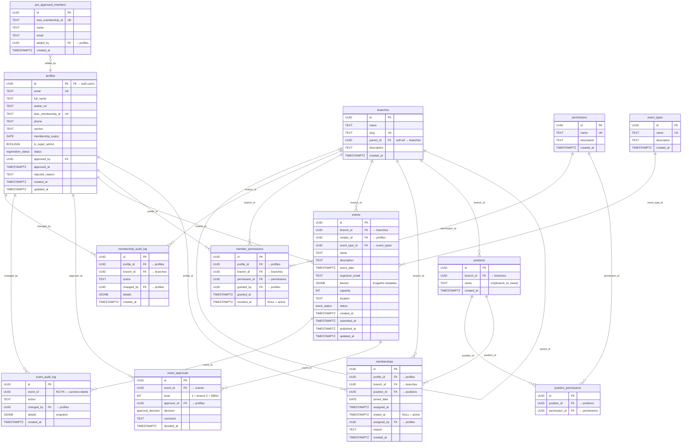

# IEEE SBNU Event Creation Portal — Database Schema (v2)

> **Last Updated:** July 2026 | **Migrations:** `00001_initial_schema.sql`, `00002_permission_system.sql`

This document is the single source of truth for the database architecture. It covers every table, enum, trigger, index, and seed record — along with the reasoning behind each decision. Written for future team members to read, review, and tweak.

---

## Table of Contents

1. [Architectural Decisions](#1-architectural-decisions--thought-process)
2. [Enums](#2-enums)
3. [Entity Relationship Diagram](#3-entity-relationship-diagram-erd)
4. [Table Reference](#4-table-reference)
5. [Triggers & Functions](#5-triggers--functions)
6. [Indexes](#6-indexes)
7. [Seeded Data](#7-seeded-data)
8. [Permission Matrix](#8-default-permission-matrix)
9. [Key Query Patterns](#9-key-query-patterns)
10. [Migration History](#10-migration-history)

---

## 1. Architectural Decisions & Thought Process

### 1.1 Identity & Registration Gating
- **Decision:** Use Supabase `auth.users` combined with a synced `profiles` table.
- **Why:** Supabase recommends keeping `auth.users` secure and separate. A trigger auto-syncs new signups to a public `profiles` table so we can safely join user data in queries without exposing auth secrets.
- **Registration Gating:** Not everyone with a `@nirmauni.ac.in` email should get access. The portal requires an **IEEE Membership ID** during signup. Accounts start in `pending` status and remain locked until:
  - **Auto-approved:** The MDO pre-loaded their membership ID into `pre_approved_members`, OR
  - **Manually approved:** An admin/MDO/SuperAdmin reviews and approves the registration.

### 1.2 Permission-Based Access Control
Previously, a simple `portal_role` enum (`member`, `admin`, `super_admin`) controlled everything. In v2, this was replaced with **granular, position-based permissions** following the principle of least privilege.
- **Decision:** Decouple "what you are called" (position) from "what you can do" (permissions).
- **Why:** When a new position is created (e.g., "Social Media Head"), the admin just assigns the right permissions to it — no code changes required. When the Chair changes, the new person automatically inherits all Chair permissions.
- **Components:**
  - `positions` → branch-scoped titles (Chair, MDO, etc.)
  - `permissions` → atomic system actions (`create_events`, `approve_registrations`, etc.)
  - `position_permissions` → maps positions to their allowed permissions
  - `member_permissions` → ad-hoc grants for individual users (override/supplement)
  - `is_super_admin` → boolean flag on `profiles` for global system bypass

### 1.3 Membership History (Append-Only)
- **Decision:** Single `memberships` table, never overwrite.
- **Why:** We need to answer "who was Chair in 2024?" without a separate history table. Active membership = `ended_at IS NULL`. On role change, set `ended_at = now()` on the old row and INSERT a new one.
- **Performance:** Partial B-Tree indexes on `ended_at IS NULL` keep active lookups fast even with years of history.

### 1.4 Multi-Level Event Approvals
- **Decision:** Separate `event_approvals` table with a `level` column.
- **Why:** Supports arbitrary approval tiers (Level 1 = Branch Chair, Level 2 = SBNU admin) without schema changes if rules evolve.

### 1.5 Hard Deletes + Audit Snapshots
- **Decision:** Events are hard-deleted. Before deletion, a full JSONB snapshot is saved in `event_audit_log`.
- **Why:** Soft deletes (`deleted_at`) pollute every query with `WHERE deleted_at IS NULL`. The audit log preserves all history with its `event_id` column intentionally **not** a foreign key (so it survives the delete).

### 1.6 Image Storage (JSONB)
- **Decision:** Store ImageKit metadata as a JSONB column on `events.banner`.
- **Why:** Extensible without schema changes. Currently stores `{ url, file_id, width, height, format }`. Can easily add thumbnails or crops later.

---

## 2. Enums

| Enum | Values | Used In |
|------|--------|---------|
| `registration_status` | `pending`, `approved`, `rejected` | `profiles.status` |
| `event_status` | `draft`, `pending_approval`, `approved`, `rejected`, `published` | `events.status` |
| `approval_decision` | `approved`, `rejected` | `event_approvals.decision` |

> **Note:** The old `portal_role` enum (`member`, `admin`, `super_admin`) was **dropped** in migration `00002`. It is replaced by the permission system.

---

## 3. Entity Relationship Diagram (ERD)



---

## 4. Table Reference

### 4.1 `profiles`
Auto-created via trigger when a user signs up. Stores public identity + registration status.

| Column | Type | Constraints | Notes |
|--------|------|-------------|-------|
| `id` | UUID | PK, FK → `auth.users` | Supabase-managed user ID |
| `email` | TEXT | NOT NULL, UNIQUE | From auth provider |
| `full_name` | TEXT | | Google profile name |
| `avatar_url` | TEXT | | Google profile picture |
| `ieee_membership_id` | TEXT | UNIQUE | e.g. `123456789` |
| `phone` | TEXT | | Contact number |
| `section` | TEXT | DEFAULT `'Gujarat Section'` | IEEE organizational section |
| `membership_expiry` | DATE | | When IEEE membership expires |
| `is_super_admin` | BOOLEAN | NOT NULL, DEFAULT `false` | Global bypass — all permissions in all branches |
| `status` | `registration_status` | NOT NULL, DEFAULT `'pending'` | Registration approval state |
| `approved_by` | UUID | FK → `profiles` | Who approved this registration |
| `approved_at` | TIMESTAMPTZ | | When they were approved |
| `rejected_reason` | TEXT | | Why registration was denied |
| `created_at` | TIMESTAMPTZ | NOT NULL, DEFAULT `now()` | |
| `updated_at` | TIMESTAMPTZ | NOT NULL, DEFAULT `now()` | Auto-updated via trigger |

---

### 4.2 `branches`
IEEE organizational hierarchy. SBNU is the root node.

| Column | Type | Constraints | Notes |
|--------|------|-------------|-------|
| `id` | UUID | PK | |
| `name` | TEXT | NOT NULL | e.g. "IEEE CS" |
| `slug` | TEXT | NOT NULL, UNIQUE | URL-safe identifier |
| `parent_id` | UUID | FK → `branches` | NULL = root (SBNU) |
| `description` | TEXT | | |
| `created_at` | TIMESTAMPTZ | NOT NULL, DEFAULT `now()` | |

---

### 4.3 `positions`
Branch-scoped organizational titles.

| Column | Type | Constraints | Notes |
|--------|------|-------------|-------|
| `id` | UUID | PK | |
| `branch_id` | UUID | NOT NULL, FK → `branches`, ON DELETE CASCADE | |
| `name` | TEXT | NOT NULL, UQ(`branch_id`, `name`) | e.g. "Chair", "MDO" |
| `created_at` | TIMESTAMPTZ | NOT NULL, DEFAULT `now()` | |

---

### 4.4 `permissions`
Atomic system-wide actions.

| Column | Type | Constraints | Notes |
|--------|------|-------------|-------|
| `id` | UUID | PK | |
| `name` | TEXT | NOT NULL, UNIQUE | Slug, e.g. `create_events` |
| `description` | TEXT | | Human-readable explanation |
| `created_at` | TIMESTAMPTZ | NOT NULL, DEFAULT `now()` | |

---

### 4.5 `position_permissions`
Maps positions → permissions (many-to-many).

| Column | Type | Constraints |
|--------|------|-------------|
| `id` | UUID | PK |
| `position_id` | UUID | NOT NULL, FK → `positions`, ON DELETE CASCADE |
| `permission_id` | UUID | NOT NULL, FK → `permissions`, ON DELETE CASCADE |
| | | UQ(`position_id`, `permission_id`) |

---

### 4.6 `member_permissions`
Direct ad-hoc permission grants to individual members (independent of position).

| Column | Type | Constraints | Notes |
|--------|------|-------------|-------|
| `id` | UUID | PK | |
| `profile_id` | UUID | NOT NULL, FK → `profiles`, ON DELETE CASCADE | |
| `branch_id` | UUID | NOT NULL, FK → `branches`, ON DELETE CASCADE | Scoped per branch |
| `permission_id` | UUID | NOT NULL, FK → `permissions`, ON DELETE CASCADE | |
| `granted_by` | UUID | NOT NULL, FK → `profiles` | Who gave this permission |
| `granted_at` | TIMESTAMPTZ | NOT NULL, DEFAULT `now()` | |
| `revoked_at` | TIMESTAMPTZ | | NULL = still active |
| | | UQ(`profile_id`, `branch_id`, `permission_id`, `granted_at`) | |

---

### 4.7 `memberships`
Append-only history of who held what position in which branch.

| Column | Type | Constraints | Notes |
|--------|------|-------------|-------|
| `id` | UUID | PK | |
| `profile_id` | UUID | NOT NULL, FK → `profiles`, ON DELETE CASCADE | |
| `branch_id` | UUID | NOT NULL, FK → `branches`, ON DELETE CASCADE | |
| `position_id` | UUID | FK → `positions` | Nullable (general member) |
| `joined_date` | DATE | | When they joined the branch |
| `assigned_at` | TIMESTAMPTZ | NOT NULL, DEFAULT `now()` | When this role started |
| `ended_at` | TIMESTAMPTZ | | NULL = currently active |
| `assigned_by` | UUID | FK → `profiles` | Who assigned this role |
| `reason` | TEXT | | Why the change was made |
| `created_at` | TIMESTAMPTZ | NOT NULL, DEFAULT `now()` | |
| | | UQ(`profile_id`, `branch_id`, `position_id`, `assigned_at`) | |

---

### 4.8 `pre_approved_members`
MDO/SuperAdmin pre-loads IEEE IDs here. Signup with a matching ID → instant approval.

| Column | Type | Constraints | Notes |
|--------|------|-------------|-------|
| `id` | UUID | PK | |
| `ieee_membership_id` | TEXT | NOT NULL, UNIQUE | Must match exactly |
| `name` | TEXT | NOT NULL | Expected name (for verification) |
| `email` | TEXT | | Optional hint |
| `added_by` | UUID | FK → `profiles` | Who added this record |
| `created_at` | TIMESTAMPTZ | NOT NULL, DEFAULT `now()` | |

---

### 4.9 `event_types`
Admin-managed lookup table for event categories.

| Column | Type | Constraints |
|--------|------|-------------|
| `id` | UUID | PK |
| `name` | TEXT | NOT NULL, UNIQUE |
| `description` | TEXT | |
| `created_at` | TIMESTAMPTZ | NOT NULL, DEFAULT `now()` |

---

### 4.10 `events`
Core event entity. Moves through a state machine: `draft` → `pending_approval` → `approved`/`rejected` → `published`.

| Column | Type | Constraints | Notes |
|--------|------|-------------|-------|
| `id` | UUID | PK | |
| `branch_id` | UUID | NOT NULL, FK → `branches`, ON DELETE CASCADE | |
| `creator_id` | UUID | NOT NULL, FK → `profiles` | Who created the draft |
| `event_type_id` | UUID | FK → `event_types` | Nullable |
| `name` | TEXT | NOT NULL | |
| `description` | TEXT | NOT NULL | |
| `event_date` | TIMESTAMPTZ | NOT NULL | |
| `organizer_email` | TEXT | NOT NULL | |
| `banner` | JSONB | | `{ url, file_id, width, height, format }` |
| `capacity` | INT | | |
| `location` | TEXT | | |
| `status` | `event_status` | NOT NULL, DEFAULT `'draft'` | |
| `created_at` | TIMESTAMPTZ | NOT NULL, DEFAULT `now()` | |
| `submitted_at` | TIMESTAMPTZ | | When submitted for approval |
| `published_at` | TIMESTAMPTZ | | When published to public |
| `updated_at` | TIMESTAMPTZ | NOT NULL, DEFAULT `now()` | Auto-updated via trigger |

---

### 4.11 `event_approvals`
One row per approval level per event.

| Column | Type | Constraints | Notes |
|--------|------|-------------|-------|
| `id` | UUID | PK | |
| `event_id` | UUID | NOT NULL, FK → `events`, ON DELETE CASCADE | |
| `level` | INT | NOT NULL, DEFAULT `1` | 1 = branch, 2 = SBNU |
| `approver_id` | UUID | NOT NULL, FK → `profiles` | |
| `decision` | `approval_decision` | NOT NULL | `approved` or `rejected` |
| `comment` | TEXT | | Reviewer's note |
| `decided_at` | TIMESTAMPTZ | NOT NULL, DEFAULT `now()` | |
| | | UQ(`event_id`, `level`) | One decision per level |

---

### 4.12 `event_audit_log`
Immutable lifecycle log. `event_id` is **not** a FK — rows survive event hard-deletes.

| Column | Type | Constraints | Notes |
|--------|------|-------------|-------|
| `id` | UUID | PK | |
| `event_id` | UUID | | **No FK** — intentional |
| `action` | TEXT | NOT NULL | `created`, `submitted`, `approved`, `rejected`, `published`, `deleted`, `edited` |
| `changed_by` | UUID | NOT NULL, FK → `profiles` | |
| `details` | JSONB | | Snapshot of changes. On delete: full event data |
| `created_at` | TIMESTAMPTZ | NOT NULL, DEFAULT `now()` | |

---

### 4.13 `membership_audit_log`
Immutable log of all membership/role/position changes.

| Column | Type | Constraints | Notes |
|--------|------|-------------|-------|
| `id` | UUID | PK | |
| `profile_id` | UUID | NOT NULL, FK → `profiles` | |
| `branch_id` | UUID | NOT NULL, FK → `branches` | |
| `action` | TEXT | NOT NULL | `role_assigned`, `role_revoked`, `position_changed`, etc. |
| `changed_by` | UUID | NOT NULL, FK → `profiles` | |
| `details` | JSONB | | `{ old_position, new_position, reason }` |
| `created_at` | TIMESTAMPTZ | NOT NULL, DEFAULT `now()` | |

---

## 5. Triggers & Functions

| Trigger | Table | Function | Purpose |
|---------|-------|----------|---------|
| `on_auth_user_created` | `auth.users` | `handle_new_user()` | Creates a `profiles` row with `status = 'pending'` when a new user signs up |
| `profiles_updated_at` | `profiles` | `update_updated_at()` | Auto-sets `updated_at = now()` on any profile update |
| `events_updated_at` | `events` | `update_updated_at()` | Auto-sets `updated_at = now()` on any event update |

### `handle_new_user()` (SECURITY DEFINER)
```sql
INSERT INTO profiles (id, email, full_name, avatar_url, status)
VALUES (NEW.id, NEW.email, COALESCE(name, full_name), avatar_url, 'pending');
```

---

## 6. Indexes

| Index | Table | Columns | Type | Notes |
|-------|-------|---------|------|-------|
| `idx_memberships_active` | `memberships` | `(profile_id, branch_id)` | Partial (`ended_at IS NULL`) | Fast active membership lookup |
| `idx_memberships_branch_active` | `memberships` | `(branch_id)` | Partial (`ended_at IS NULL`) | All active members in a branch |
| `idx_member_permissions_active` | `member_permissions` | `(profile_id, branch_id)` | Partial (`revoked_at IS NULL`) | Active direct permission grants |
| `idx_events_branch_status` | `events` | `(branch_id, status)` | B-Tree | Dashboard: events by branch + status |
| `idx_events_creator` | `events` | `(creator_id)` | B-Tree | "My events" list |
| `idx_event_approvals_event` | `event_approvals` | `(event_id)` | B-Tree | Approvals for an event |
| `idx_event_audit_event` | `event_audit_log` | `(event_id)` | B-Tree | Audit trail for an event |
| `idx_event_audit_action` | `event_audit_log` | `(action)` | B-Tree | Filter by action type |
| `idx_membership_audit_profile` | `membership_audit_log` | `(profile_id)` | B-Tree | Audit trail for a user |
| `idx_membership_audit_branch` | `membership_audit_log` | `(branch_id)` | B-Tree | Audit trail for a branch |

---

## 7. Seeded Data

### 7.1 Branches
| Name | Slug | Parent |
|------|------|--------|
| IEEE SBNU | `sbnu` | — (root) |
| IEEE SIGHT | `sight` | SBNU |
| IEEE WIE | `wie` | SBNU |
| IEEE CS | `cs` | SBNU |
| IEEE ITSS | `itss` | SBNU |
| IEEE SPS | `sps` | SBNU |

### 7.2 Positions (per branch × 6 branches = 36 rows)
`Chair`, `Vice Chair`, `General Secretary`, `Technical Head`, `Creative Head`, `MDO`

### 7.3 Event Types
`Workshop`, `Hackathon`, `Guest Lecture`, `Social`, `Competition`, `Seminar`

### 7.4 Permissions
| Name | Description |
|------|-------------|
| `create_events` | Create event drafts in a branch |
| `approve_events` | Approve or reject pending events |
| `manage_events` | Edit or delete any event in the branch |
| `manage_members` | Assign positions and grant permissions |
| `approve_registrations` | Approve or reject new member signups |
| `view_members` | View member list and role history |
| `view_audit_log` | Access the audit trail |
| `manage_event_types` | Add or edit event categories |
| `manage_positions` | Create custom positions for the branch |

---

## 8. Default Permission Matrix

Shows which permissions each position gets **out of the box** (seeded in migration `00002`):

| Permission | Chair | Vice Chair | Gen. Secretary | Tech Head | Creative Head | MDO |
|:-----------|:-----:|:----------:|:--------------:|:---------:|:-------------:|:---:|
| `create_events` | ✅ | ✅ | ✅ | ✅ | ✅ | |
| `approve_events` | ✅ | ✅ | | | | |
| `manage_events` | ✅ | ✅ | | | | |
| `manage_members` | ✅ | ✅ | | | | |
| `approve_registrations` | ✅ | ✅ | | | | ✅ |
| `view_members` | ✅ | ✅ | | ✅ | ✅ | ✅ |
| `view_audit_log` | ✅ | ✅ | ✅ | | | |
| `manage_event_types` | ✅ | | | | | |
| `manage_positions` | ✅ | | | | | |

> **SuperAdmin** (`is_super_admin = true` on `profiles`) bypasses this matrix entirely — all permissions in all branches.

---

## 9. Key Query Patterns

### Check if user is SuperAdmin
```sql
SELECT is_super_admin FROM profiles WHERE id = $1;
```

### Get all permissions for a user in a branch
```sql
-- Combines position-based + direct grants
SELECT DISTINCT p.name
FROM memberships m
JOIN position_permissions pp ON m.position_id = pp.position_id
JOIN permissions p ON pp.permission_id = p.id
WHERE m.profile_id = $1
  AND m.branch_id = $2
  AND m.ended_at IS NULL

UNION

SELECT p.name
FROM member_permissions mp
JOIN permissions p ON mp.permission_id = p.id
WHERE mp.profile_id = $1
  AND mp.branch_id = $2
  AND mp.revoked_at IS NULL;
```

### Fetch all active members in a branch
```sql
SELECT m.*, p.full_name, p.email, pos.name AS position_name
FROM memberships m
JOIN profiles p ON m.profile_id = p.id
LEFT JOIN positions pos ON m.position_id = pos.id
WHERE m.branch_id = $1 AND m.ended_at IS NULL
ORDER BY pos.name, p.full_name;
```

### Historical lookup: past Chairs of CS branch
```sql
SELECT p.full_name, m.assigned_at, m.ended_at
FROM memberships m
JOIN profiles p ON m.profile_id = p.id
JOIN positions pos ON m.position_id = pos.id
WHERE m.branch_id = $1
  AND pos.name = 'Chair'
ORDER BY m.assigned_at DESC;
```

### Pending registrations queue (for admin/MDO)
```sql
SELECT id, full_name, email, ieee_membership_id, section, created_at
FROM profiles
WHERE status = 'pending'
ORDER BY created_at ASC;
```

### Check if a membership ID is pre-approved
```sql
SELECT id FROM pre_approved_members
WHERE ieee_membership_id = $1;
```

---

## 10. Migration History

| Migration | Description | Key Changes |
|-----------|-------------|-------------|
| `00001_initial_schema.sql` | Foundation schema | Created all core tables: profiles, branches, positions, memberships, events, event_types, event_approvals, event_audit_log, membership_audit_log. Seeded branches, positions, and event types. |
| `00002_permission_system.sql` | Permission-based access + registration gating | Dropped `portal_role` enum and `can_create_events` column. Added `permissions`, `position_permissions`, `member_permissions`, `pre_approved_members` tables. Added registration fields to `profiles` (`ieee_membership_id`, `status`, `is_super_admin`, etc.). Seeded MDO position and full permission matrix. |
